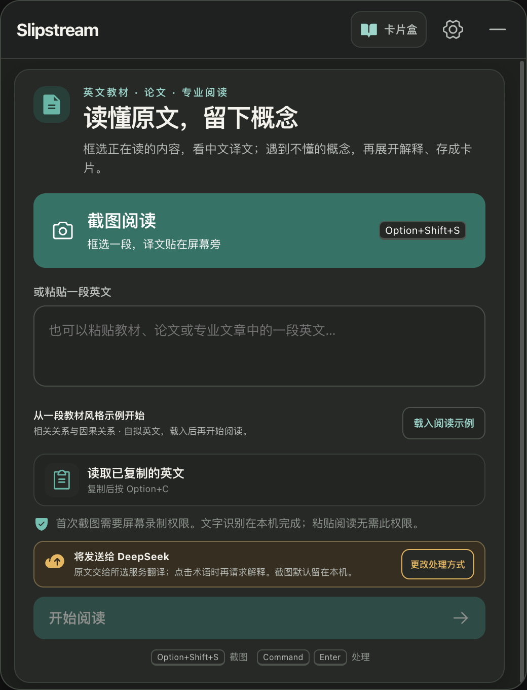
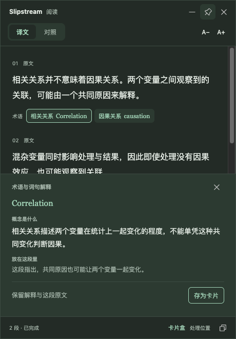

<p align="right"><strong>简体中文</strong> · <a href="./README.en.md">English</a></p>

<div align="center">
  
  <h1>Slipstream</h1>
  <p><strong>读懂原文，留下概念。</strong></p>
  <p>给中文母语者的专业英文阅读工具。<br>框选教材、论文或专业文章，把中文译文贴在屏幕旁；<br>遇到不懂的术语，结合原文解释，再存进自己的本地卡片盒。</p>
  <p><a href="#开始使用">开始使用</a> · <a href="./docs/reading-pins.md">阅读功能说明</a> · <a href="https://github.com/0boluan0/Slipstream/issues">反馈问题</a></p>
</div>

> **阅读版 v1.1.0** · macOS 12+ · [下载安装包](https://github.com/0boluan0/Slipstream/releases/tag/v1.1.0) · 已安装正式版可从菜单选择“检查更新”。

<p align="center"></p>

## 不离开正在读的那一页

读英文原版时，卡住你的可能是一句话，也可能是一个熟悉译名、却还没理解的概念。Slipstream 把帮助放在阅读位置旁：先让你读下去，再展开需要弄懂的内容。

1. **框选原文**：按 `Option + Shift + S`，截取正在读的一两段英文。
2. **先看中文**：译文出现在独立浮窗里，可移动、缩放、置顶，随时切换中英对照。
3. **按需解释术语**：点击推荐术语，看“概念是什么”和“放在这段里”。也可以在英文原文中选中词句查询。
4. **留下有用的概念**：点击“存为卡片”，保留解释和原文，之后补上自己的理解、关联其他卡片。
5. **继续阅读**：临时浮窗用完就关，主动保存的卡片仍留在本地。

也可以粘贴英文后点击“开始阅读”，或复制文字后按 `Option + C`。文字输入不需要屏幕录制权限。

## 中文译文之外，把概念弄明白

| 阅读时的需要 | Slipstream 的处理方式 |
| --- | --- |
| 一段英文读得慢 | 先显示通顺的中文译文，按段查看原文 |
| 认识译名，却不知道概念是什么 | 结合当前段落解释专业含义及它在文中的作用 |
| 没有需要解释的术语 | 只显示译文；术语推荐可以为空，不凑数量 |
| 想查询没有被推荐的词句 | 在英文原文中选中后主动查询 |
| 想把概念变成自己的知识 | 保存为 Markdown 卡片，编辑解释、补充笔记、建立关联和反向关联 |
| 原文带数学公式 | 保留并渲染 LaTeX；疑似数学识别内容先核对，再继续翻译 |

<p align="center"></p>

截图使用自拟阅读材料和固定示例回复，用于展示真实界面与操作流程；它们不是模型质量测评。

## 卡片存在你自己的文件夹里

默认位置是系统“文稿”文件夹下的 `Slipstream/术语卡片/`。每张卡片都是可以直接打开的 Markdown 文件，包含英文术语、中文名称、概念解释、本段用法、原文和个人笔记。

卡片盒支持搜索、编辑、关联卡片与反向关联。仅在你点击保存时写入，关闭临时阅读浮窗不会删除已保存的卡片。系统是否同步“文稿”文件夹，取决于你的 macOS 设置。

<p align="center"></p>

## 数学公式

译文、术语解释和本地卡片支持行内与独立 LaTeX 公式渲染，复制时保留 LaTeX。独立公式沿用原文，疑似数学 OCR 结果先进入可编辑核对界面。

使用支持的 DeepSeek 配置时，可以主动选择“识别公式”，将当前截图交给视觉模型转写；转写后仍需对照截图确认。该操作会单独说明图片去向。公式支持用于保留和阅读数学内容，复杂排版与识别结果仍需要人工核对。

## 开始使用

支持 **macOS 12 及以上**。下载与你的 Mac 对应的安装包，将 Slipstream 拖入“应用程序”：

- [Apple 芯片版](https://github.com/0boluan0/Slipstream/releases/download/v1.1.0/Slipstream-1.1.0-arm64.dmg)
- [Intel 版](https://github.com/0boluan0/Slipstream/releases/download/v1.1.0/Slipstream-1.1.0-x64.dmg)

已安装正式版可从 Slipstream 菜单检查更新，下载完成后确认重启安装。独立“Slipstream 阅读预览”使用单独的配置与权限，请安装正式版并完成其首次配置。

从源码启动需要 **Node.js 22.12+** 和 **Xcode Command Line Tools**：

```bash
git clone https://github.com/0boluan0/Slipstream.git
cd Slipstream/slipstream
npm ci
npm run dev
```

首次启动选择适合自己的模式：

| 专业阅读 | 基础翻译 |
| --- | --- |
| 中文译文、上下文术语解释、本地概念卡片 | 中文译文与选词翻译 |
| 配置 DeepSeek、OpenAI、Anthropic、兼容服务或本机 Ollama | 无需 API Key，使用在线翻译服务 |
| 云模型可能产生调用费用；本地模型质量取决于配置 | 文本先发往 Google Translate，必要时使用 MyMemory |

首次截图按 macOS 提示允许屏幕录制。如果系统要求退出并重新打开应用，请完成后再截图。开发运行和安装包的权限归属可能不同；使用固定应用身份的预览构建可减少重复授权。构建、验证和权限排查见[开发说明](./slipstream/README.md)。

## 数据如何处理

- **截图识字在本机**：默认使用 Apple Vision。主动选择公式识别时，当前截图才会发送给所说明的视觉服务。
- **处理位置可见**：原文发给你选定的服务翻译；点击词句后，再发送词句与本次阅读上下文请求解释。本机 Ollama 使用本地端点。
- **保存由你决定**：临时阅读卡片不自动成为历史记录；主动保存的概念卡片包含解释和原文。
- **剪贴板监听默认关闭**，开启前确认处理去向，开启后界面和菜单栏持续显示去向及关闭入口；API Key 使用 macOS 加密存储；应用没有账户、广告或产品分析埋点。

详见[隐私与数据流](./docs/PRIVACY.md)。

## 项目状态与参与

当前重点是把“截图 → 阅读 → 理解术语 → 留下卡片”做顺。术语由所配置的模型筛选和解释，质量仍会波动；原文始终可供核对。自动推荐并不知道你已经掌握了哪些概念。

- [产品规格](./SPEC.md) · [阅读行为与验收](./docs/reading-pins.md)
- [开发与构建](./slipstream/README.md) · [贡献指南](./CONTRIBUTING.md)
- [历史版本](https://github.com/0boluan0/Slipstream/releases) · [更新记录](./CHANGELOG.md)

采用 [MIT License](./LICENSE) 开源。欢迎带着具体段落和使用体验[提交反馈](https://github.com/0boluan0/Slipstream/issues)，请移除私人内容。
