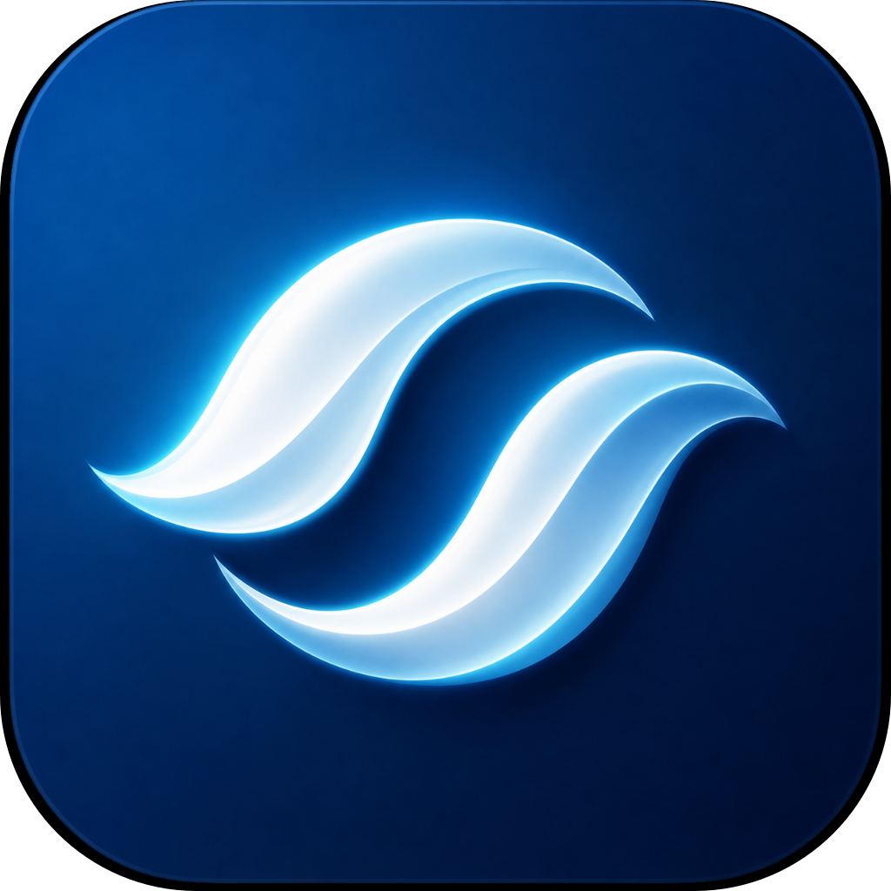
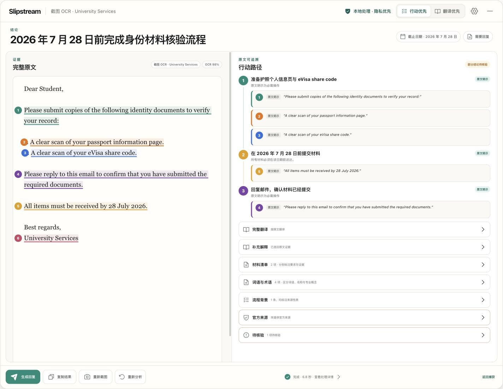

  <strong>English</strong> · <a href="./README.zh-CN.md">简体中文</a>

  
  <h1>Slipstream</h1>
  
<strong>Understand the English. Know exactly what to do next.</strong>

  
Capture or copy an English email, letter, form, or portal. Slipstream turns it into a Chinese action plan—and links every step back to the words that support it.

  

    
  

  

    
    
    
  

## English should not leave you guessing

A translation tells you what the words mean. Slipstream also helps you understand the task behind them:

- **What to do, in order** — actions, materials, deadlines, and reply requirements become one clear path.
- **Why you should trust it** — numbered, colour-matched evidence connects each action to the exact original wording.
- **What unfamiliar language means here** — everyday phrases, professional terms, and unfamiliar social or administrative processes are explained separately.
- **How to move forward** — when the source asks for a reply, Slipstream can prepare an editable English draft. It never sends or submits anything for you.

## From source to next step

| 1. Capture | 2. Understand | 3. Act |
| --- | --- | --- |
| Select part of the screen with `Option+Shift+S`, read copied text with `Option+C`, or paste text manually. | Review the Chinese conclusion and ordered action path beside the complete original. Every important claim points back to its evidence. | Check materials and dates, understand terms or process background, mark your progress, and prepare a reply when one is required. |

You can choose **Action first** when you need the next step immediately, or **Translation first** when you want to read the full translation before the action plan.

## Three kinds of “I don't understand”

| The problem | What Slipstream shows |
| --- | --- |
| An unfamiliar word or phrase | A plain Chinese meaning for this sentence |
| A professional term, form, institution, or portal | What it means in this task and whether it changes what you need to do |
| An unfamiliar cultural or administrative process | What it is, why it exists, and the practical next step |

Outside knowledge is kept visually separate from what the original source actually says.

## Choose how much help you need

| Full analysis | Basic translation |
| --- | --- |
| Translation, actions, materials, dates, terminology, process background, source evidence, and reply help | Translation only |
| Use local Ollama, Anthropic, OpenAI, DeepSeek, or a compatible service you configure | No setup required |
| The app shows the destination before you submit | Text is sent to Google Translate and, only if needed, MyMemory |

## Download and install

Slipstream supports **macOS 12 or later**.

| Your Mac | Download |
| --- | --- |
| Apple silicon — M1, M2, M3, M4, and later | [Slipstream 1.0.6 for arm64](https://github.com/0boluan0/Slipstream/releases/download/v1.0.6/Slipstream-1.0.6-arm64.dmg) |
| Intel processor | [Slipstream 1.0.6 for x64](https://github.com/0boluan0/Slipstream/releases/download/v1.0.6/Slipstream-1.0.6-x64.dmg) |

1. Open the downloaded DMG.
2. Drag **Slipstream** into **Applications**.
3. Launch it normally. The app is signed with an Apple Developer ID and notarized by Apple.
4. Allow Screen Recording when macOS asks if you want to capture text from the screen. Pasting and copied-text capture do not need that permission.

Version 1.0.6 is the first version that can update inside Slipstream. It checks the public GitHub release feed after launch, asks before downloading, and asks again before restarting to install. Earlier versions need this one manual installation first.

Not sure which Mac you have? Open ** → About This Mac**. Choose `arm64` for an Apple M-series chip and `x64` for Intel.

## Privacy you can see

- Screenshot text recognition uses Apple Vision and runs on your Mac.
- Slipstream keeps no history of your original cases and collects no product analytics.
- The destination of a full analysis is shown before submission; local Ollama can keep the source on your Mac.
- If a model proposes tasks, materials, or deadlines, full analysis may send the same source and those claims to the same configured service once more for a short accuracy review. An online provider may charge for both calls.
- Official-source lookup asks before sending a minimized query or opening a candidate page. Finding a page is not presented as proof by itself.
- Clipboard monitoring is off by default. Clipboard monitoring requires a destination-specific confirmation. When enabled, the main task surface and macOS menu keep the destination and a direct off action visible.

Read the complete [privacy and data-flow explanation](./docs/PRIVACY.md).

## Clear limits

- Version 1 officially supports English-to-Chinese on macOS.
- Slipstream helps you understand and prepare; it does not send emails, upload documents, submit forms, or complete real-world tasks on your behalf.
- AI-generated analysis can be wrong. For consequential tasks, compare the action with its highlighted source and check the relevant official service.
- Basic translation does not include action extraction, terminology, process explanations, or source-linked evidence.

## Open source, free to use

Slipstream is a non-commercial portfolio project released under the [MIT License](./LICENSE). It is built for people who live, study, or work with English-speaking systems without English being their first language.

Questions or problems? [Open an issue](https://github.com/0boluan0/Slipstream/issues).
