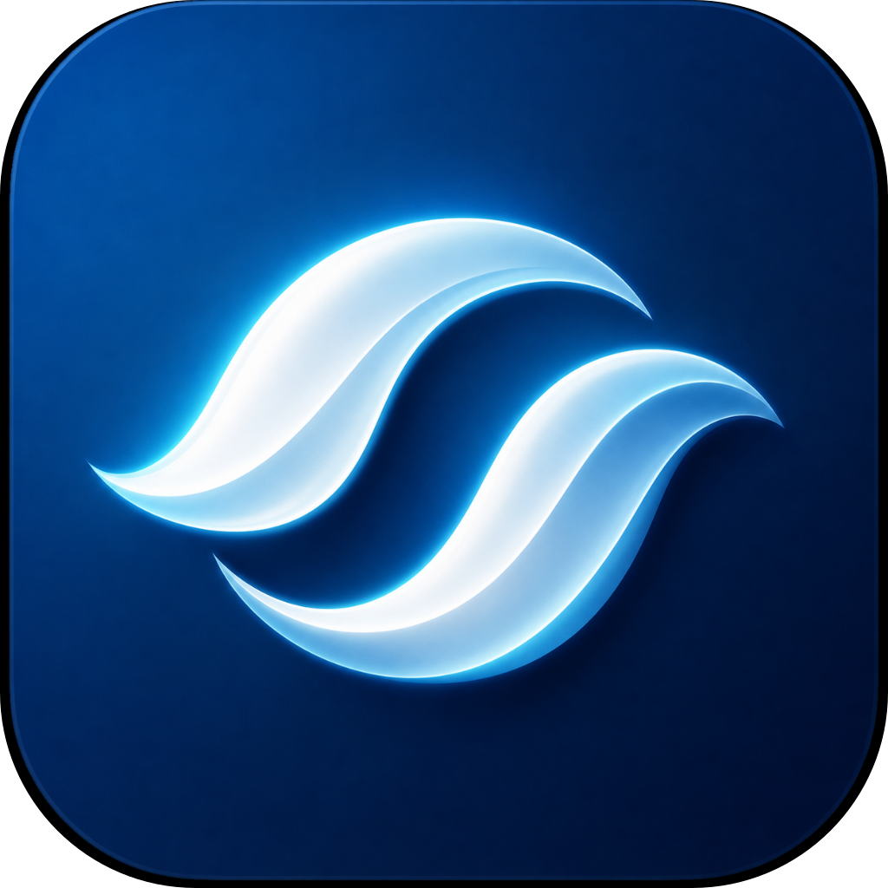

<p align="right"><strong>简体中文</strong> · <a href="./README.en.md">English</a></p>

<div align="center">
  
  <h1>Slipstream</h1>
  <p><strong>卡住哪一块，就划哪一块。</strong></p>
  <p>阅读英文时的随手查工具。<br>框选不懂的词句、短段落或公式，把中文和解释贴在原文旁；<br>看懂后继续读，有用的概念可以存为本地卡片。</p>
  <p><a href="#开始使用">开始使用</a> · <a href="./docs/reading-pins.md">阅读功能说明</a> · <a href="https://github.com/0boluan0/Slipstream/issues">反馈问题</a></p>
</div>

> **阅读版 v1.2.1** · macOS 12+ · [下载安装包](https://github.com/0boluan0/Slipstream/releases/tag/v1.2.1) · 已安装正式版可从菜单选择“检查更新”。

**[下载 Windows 未签名版（约 160 MB）](https://github.com/0boluan0/Slipstream/releases/download/v1.3.0-preview.2/Slipstream-Windows-Preview-1.3.0-preview.2-x64-Setup.exe)** · [安装步骤与系统提示](./docs/windows-preview.md#下载与安装)

## 不离开正在读的那一页

读英文原版时，卡住你的可能是一句话、一个概念或一条公式。Slipstream 把帮助放在阅读位置旁，解决眼前这一小块疑问，让你继续读。它的主要用途是局部查阅；整篇翻译和深入研读不属于这条主要流程。

1. **划出不懂的这一块**：按 `Option + Shift + S`，屏幕变暗后拖出亮框，选中词句、短段落或公式及必要的说明。松开鼠标开始阅读；`Esc` 取消。
2. **看中文，按需查词**：译文贴在旁边，可切换中英对照。需要解释时点击术语，或在英文中选中词句查询。
3. **继续读**：看懂后关闭临时浮窗，回到原文。

想留下某个概念时，再点击“存为卡片”，保存解释和原文，之后补充笔记。保存卡片和管理本文速查都按需使用。

也可以粘贴英文后点击“开始阅读”，或复制文字后按 `Option + C`。文字输入不需要屏幕录制权限。

## 中文译文之外，把概念弄明白

| 阅读时的需要 | Slipstream 的处理方式 |
| --- | --- |
| 一段英文读得慢 | 先显示通顺的中文译文，按段查看原文 |
| 认识译名，却不知道概念是什么 | 结合当前段落解释专业含义及它在文中的作用 |
| 没有需要解释的术语 | 只显示译文；术语推荐可以为空，不凑数量 |
| 想查询没有被推荐的词句 | 在英文原文中选中后主动查询 |
| 想把概念变成自己的知识 | 保存为 Markdown 卡片，编辑解释、补充笔记、建立关联和反向关联 |
| 原文带数学公式 | 保留并渲染 LaTeX；读图路径直接显示译文，没看清的位置提示重新框选 |

截图使用自拟阅读材料和固定示例回复，用于展示真实界面与操作流程；它们不是模型质量测评。

## 卡片存在你自己的文件夹里

默认位置是系统“文稿”文件夹下的 `Slipstream/术语卡片/`。每张卡片都是可以直接打开的 Markdown 文件，包含英文术语、中文名称、概念解释、本段用法、原文和个人笔记。

卡片盒支持搜索、编辑、关联卡片与反向关联。仅在你点击保存时写入，关闭临时阅读浮窗不会删除已保存的卡片。系统是否同步“文稿”文件夹，取决于你的 macOS 设置。

## 本文速查

[「本文速查」](./docs/reading-references.md)：按论文记住符号、缩写和本文约定，保留原文依据，跨截图查询、隔天继续阅读。候选定义由你决定是否留下；本地查询与长期概念卡片盒各有入口。

## 数学公式

保留本机识字方式：Apple Vision 和随包附带的[本地公式识别](./docs/local-formula-ocr.md)恢复文字与 LaTeX，疑似公式进入核对。未启用图片试读的旧配置、基础翻译继续使用这条路径，不需要另配公式服务。

点击核对页中的公式，可以直接定位到对应 LaTeX。校正时原始截图就在编辑框上方，可放大查看；切换截图与核对页会保留尚未提交的修改。

使用支持的 DeepSeek 配置时，可以主动选择“识别公式”，将当前截图交给视觉模型转写；转写后仍需对照截图确认。该操作会单独说明图片去向。公式支持用于保留和阅读数学内容，复杂排版与识别结果仍需要人工核对。

## 开始使用

支持 **macOS 12 及以上**。下载与你的 Mac 对应的安装包，将 Slipstream 拖入“应用程序”：

- [Apple 芯片版](https://github.com/0boluan0/Slipstream/releases/download/v1.2.1/Slipstream-1.2.1-arm64.dmg)
- [Intel 版](https://github.com/0boluan0/Slipstream/releases/download/v1.2.1/Slipstream-1.2.1-x64.dmg)

已安装正式版可从 Slipstream 菜单检查更新，下载完成后确认重启安装。独立“Slipstream 阅读预览”使用单独的配置与权限，请安装正式版并完成其首次配置。

从源码启动需要 **Node.js 22.12+** 和 **Xcode Command Line Tools**：

```bash
git clone https://github.com/0boluan0/Slipstream.git
cd Slipstream/slipstream
npm ci
npm run setup:formula-models
npm run dev
```

首次启动选择适合自己的模式：

| 专业阅读 | 基础翻译 |
| --- | --- |
| 中文译文、上下文术语解释、本地概念卡片 | 中文译文与选词翻译 |
| 配置支持图片的 DeepSeek、OpenAI、Anthropic、兼容服务或本机 Ollama；同一配置也处理文字 | 无需 API Key，使用在线翻译服务 |
| 云模型可能产生调用费用；本地模型质量取决于配置 | 文本先发往 Google Translate，必要时使用 MyMemory |

首次截图按 macOS 提示允许屏幕录制。如果系统要求退出并重新打开应用，请完成后再截图。开发运行和安装包的权限归属可能不同；使用固定应用身份的预览构建可减少重复授权。构建、验证和权限排查见[开发说明](./slipstream/README.md)。

专业阅读的首次设置会试读一张自拟教材图片，并查询一个术语；成功后点击“启用截图阅读”。已有配置需在设置中完成图片试读并明确启用，之后直接快捷键拖框。推荐模型为实测支持图片的 `deepseek-flash`；其他模型须通过图片试读。

本机识字方式首次准备可能需要约半分钟，准备好后自动继续。直接读图不等待本地公式识别；关闭卡片取消本次请求。

## 数据如何处理

- **图片试读启用后**：你主动框选的图片交给当前配置的服务读取并翻译，选区外画面不发送。截图、翻译与解释共用一套 API；服务可能记录请求并收费。本机识字方式保留，旧配置不会自动开始上传图片。
- **处理位置可见**：原文发给你选定的服务翻译；多个术语候选会由同一服务再做一次短复核，译文先显示；点击词句后，再发送词句与本次阅读上下文请求解释。本机 Ollama 使用本地端点。
- **保存由你决定**：临时阅读卡片不自动成为历史记录；主动保存的概念卡片包含解释和原文。
- **剪贴板监听默认关闭**，开启前确认处理去向，开启后界面和菜单栏持续显示去向及关闭入口；API Key 使用 macOS 加密存储；应用没有账户、广告或产品分析埋点。

详见[隐私与数据流](./docs/PRIVACY.md)与 [Windows 预览隐私说明](./docs/windows-privacy.md)。

## Code signing policy

Windows 预览以未签名安装包提供。首次安装可能出现“未知发布者”或 SmartScreen 提示，见[安装说明](./docs/windows-preview.md#下载与安装)。签名状态、构建来源与发行要求见 [Code signing policy](./docs/code-signing.md)。

## 项目状态与参与

当前重点是把“截图 → 阅读 → 理解术语 → 留下卡片”做顺。术语由所配置的模型筛选和解释，质量仍会波动；原文始终可供核对。自动推荐并不知道你已经掌握了哪些概念。

- [产品规格](./SPEC.md) · [阅读行为与验收](./docs/reading-pins.md)
- [开发与构建](./slipstream/README.md) · [贡献指南](./CONTRIBUTING.md)
- [历史版本](https://github.com/0boluan0/Slipstream/releases) · [更新记录](./CHANGELOG.md)

采用 [MIT License](./LICENSE) 开源。欢迎带着具体段落和使用体验[提交反馈](https://github.com/0boluan0/Slipstream/issues)，请移除私人内容。
