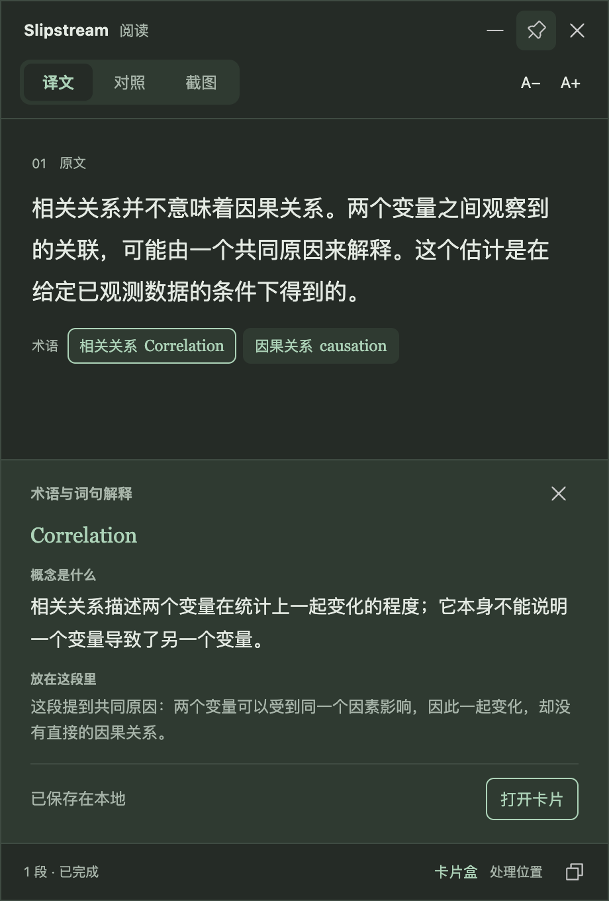
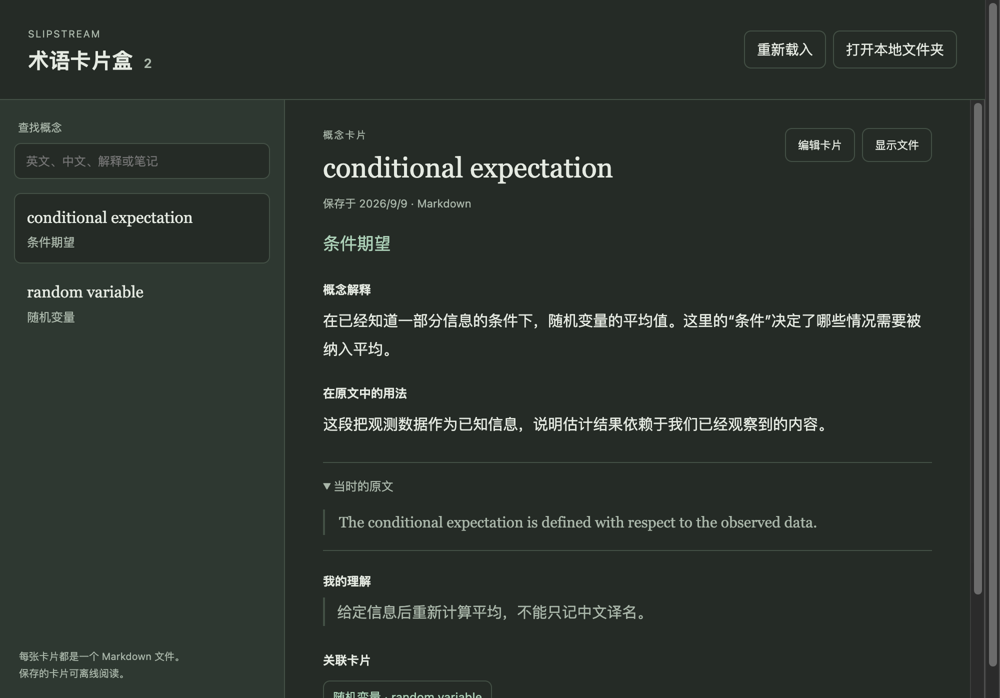

# 专业英文阅读与术语卡片盒

Slipstream 通过快捷键框选当前屏幕上的英文，生成可移动、缩放和置顶的阅读卡片。中文译文帮助继续阅读；专业术语帮助理解概念；主动保存的术语逐步构成本地知识卡片盒。

## 一次阅读

1. 按截图快捷键（默认 Option + Shift + S），框选教材或论文的一两段英文。也可以在首页粘贴后点击“开始阅读”，或复制后按 Option + C；文字输入进入相同的独立阅读卡片，无需屏幕录制权限。
2. 阅读卡片按段显示中文译文。有需要进一步解释的专业概念时，才在段落下面显示术语，同时保留英文名称；没有合适术语时只显示译文。
3. 点击术语，展开“概念是什么”和“放在这段里”。解释使用本次截图的上下文；译文和解释都能回到英文核对。
4. 通过“对照”逐段阅读中英文。自动识别没有覆盖的词句，可以在英文中选中后查询。
5. 点击“存为卡片”，将解释和这次原文保存为独立 Markdown 文件。
6. 收起、移动或关闭临时阅读卡片。已保存的术语仍在卡片盒中。

## 本地卡片

默认目录为系统“文稿”文件夹下的 `Slipstream/术语卡片/`。首页、菜单栏和阅读卡片都能打开卡片盒；卡片盒提供搜索、阅读全文、编辑解释、个人笔记、关联卡片和显示本地文件。

每张卡片包含英文名称、中文名称、概念解释、原文中的用法、原文、个人理解、创建/更新日期和关联卡片。关联存为本地 Markdown 链接，并在应用内计算反向关联。读者可以从一张卡片继续浏览相关概念。

同一术语与同一原文重复保存时，返回已有卡片；另一段原文中的用法保留为独立卡片。编辑使用文件版本校验，检测到其他编辑器的修改时保留输入并提示重新载入，不覆盖外部修改。

卡片只在主动保存时写入。关闭截图会释放临时截图与结果，但保留文稿目录里的 Markdown。应用内重置也保留这些文稿文件，确认界面说明这一范围。系统配置的文稿同步方式由系统管理。

## 阅读行为

- 截图快捷键在配置完成后直接进入系统框选。现有阅读卡片在框选时临时隐藏。
- 每次框选生成独立卡片；识别和模型请求各自取消。新卡片显示时不抢走原阅读应用的焦点。
- 使用 Vision 文字行的位置重组段落。识别置信度不足或疑似多栏/表格时，先对照截图核对文字与阅读顺序。
- 每张卡片最多同时翻译两段；完成一段即显示一段。失败段落可独立重试。
- 自动术语由当前配置的文字模型在翻译请求中筛选，目标是帮助理解有概念门槛的词句。普通词汇、一般研究用语和直译已足够的描述性短语不自动推荐；普通词在具有专门含义的上下文中仍可入选。没有合适术语时返回空列表，整行术语隐藏，不发起补齐请求。六个是上限，没有最低数量。
- 入选术语必须能在该段英文中精确匹配。程序验证引用、去重和数量，筛选是否有用仍依赖模型判断；当前不推断用户掌握程度，也没有个人熟词表。
- 自动术语按完整词的边界定位。例如 `direct effect` 对应独立出现的“直接效应”，不会落在前面的 `indirect effect` 内部；只作为另一个单词片段出现的候选会移除。手动选词仍保留用户选中的精确范围。
- 术语解释在点击后请求；选词位置由主进程验证。切换词句会取消前一次查询，重复打开使用当前卡片内的缓存。
- 基础翻译服务提供译文和选词翻译；概念识别及上下文解释使用已配置的模型。基础翻译明确标记为翻译。
- 支持译文/对照/原始截图切换、字号调整、复制完整译文、置顶、原生拖动和缩放。双击顶部或点击收起保留小标题条。
- Esc 优先收起查询或菜单，再关闭当前卡片；Command+W 直接关闭。处理位置可从底部展开。
- 默认截图保留在本机，模型收到识别文本。只有主动选择“发送截图到 DeepSeek，识别公式”时才会发送本次截图；该次发送在处理位置中保留提示。保存的概念解释可以编辑；识别与解释的正确性仍需要在具体材料中核对。

## 数学公式

译文、术语解释、核对预览和本地卡片支持 `$...$`、`$$...$$`、`\(...\)`、`\[...\]`。KaTeX 与字体随应用提供，离线排版；失败时显示原始 LaTeX。复制译文、编辑、Markdown 存储始终保留公式源码。长公式可以在自身区域横向滚动。

分段不会切断公式环境；独立公式直接保留，不提交模型改写。原文选词使用原始字符偏移，避免数学排版改变引用位置。

普通 Apple Vision OCR 不足以识别复杂数学结构。检测到数学符号会进入核对；这只是启发式提示，不能保证发现所有漏识别的公式。任何截图均可从“截图 → 识别公式”进入专门转写；本地 OCR 完全没有识别到文字时也可使用。

当前公式转写使用已配置的 DeepSeek 密钥和 `deepseek-v4-flash-vision-exp`，不改变文字模型设置。按钮明确说明截图将发送到 DeepSeek，转写完成后必须对照原图核对，再确认翻译；可在编辑框中校正 LaTeX 并立即预览。其他服务配置仍可使用本地排版与手动校正。

公式转写只请求抄录，保留不确定项；关闭卡片、改变服务会取消请求，过期结果不覆盖当前原文。图片始终来自当前选区，不接受渲染器传入的图片地址。实现依据 [DeepSeek 图像输入文档](https://api-docs.deepseek.com/guides/vision/) 和 [KaTeX 安全选项](https://katex.org/docs/security)。

## 验证

`npm run check:reading-pins` 包括文本契约、Markdown 存储和两个原生 Electron 流程检查。覆盖术语来源匹配、查询位置校验、缓存与过期响应、主动保存、跨窗口关闭保留、重启读取、重复保存、不同语境、个人笔记、关联与反向关联、外部编辑冲突、低置信度核对、部分失败重试、缩放、折叠、复制、网络隔离和临时截图清理。

原生自动检查使用自拟英文、真实 Apple Vision OCR 和固定的模型回复。它验证程序行为，不代表在线模型的学术解释质量。

实际屏幕框选可通过完整应用或 `npx electron scripts/check-reading-pins-live.js` 检查。在线概念检查为显式运行的 `npx electron scripts/check-reading-concepts-live.js --configured-profile`，读取现有应用的加密配置，仅提交脚本内的自拟学术段落。开发进程若无法解密应用凭据，会在发送请求前退出。

## 当前截图

## 本轮验证记录（2026-09-09）

- `npm test` 全部通过；新增阅读/卡片盒检查在最后补充手动选词和外部编辑冲突恢复场景后再次通过。
- `npm run lint`、生产渲染器构建和 `git diff --check` 通过。
- Apple 芯片本地应用包已构建，并通过 `codesign --verify --deep --strict`。当前应用位于 `~/Applications/Slipstream 阅读预览.app`。
- 本地预览入口在启动前使用独立的设置和浏览器会话目录；安装版配置保留在原位置。相关路径设置遵循 [Electron app 文档](https://www.electronjs.org/docs/latest/api/app/#appsetpathname-path) 的启动时序。
- 原生窗口已人工检查术语展开、阅读/编辑切换和关联概念跳转。截图中的学术段落与解释是用于交互验证的固定样例。
- 真实 DeepSeek 检查已跑通条件期望、混杂变量，以及带积分、求和、分式和矩阵的自拟段落：图像转写、译文、术语解释、Markdown 保存、关闭阅读窗口后从新存储实例重开。初次原始结果与耗时保留在 `docs/math-evidence/live-initial/`；最终包复测输出到 `docs/math-evidence/live/`。
- 实验图片由原生 Electron 窗口渲染生成，进入实际 OCR 与模型服务；此检查不覆盖系统鼠标框选。系统框选进程能启动，但本轮自动操作工具没有完成系统选区，仍需人工验收这一操作。
- 本地 OCR 对该公式样例给出了 0.875–0.9 的平均置信度，却漏掉积分并破坏矩阵结构。初次视觉转写约 2.1 秒，恢复了测试图片的两组公式；这不是对任意教材截图的准确率或延迟承诺。
- 初次概念回复仍出现额外条件与过强措辞，已据此加强概念/语境区分、必要条件和完整公式的提示约束。在线模型输出未经逐条权威来源审核，不标为已验证知识。
- 本地预览验收时，`npm audit --omit=dev` 报告 4 个 high 条目，涉及既有 ajv、electron-updater、fast-uri、js-yaml 依赖；新增 KaTeX 未被列入。本次本地预览不更新旧的公开发布安全结论。

### 可复现的在线检查

本地预览的专用检查入口可用 `--reading-check --reading-check-output=<绝对输出目录>` 启动。它只提交代码中自拟的两段学术英文和一张公式图片；读取独立预览配置，在内存中解密当前 DeepSeek 密钥。模型原始结果、每次耗时、OCR 数据、公式核对/阅读/卡片盒截图和一张测试 Markdown 保存在指定目录。测试卡片使用临时卡片盒，不写入用户的文稿目录。常规应用启动不会运行此检查。

源码检查入口为 `scripts/check-reading-math.js` 与 `scripts/check-reading-math-native.js`，已并入 `check:reading-pins` 和 `npm test`。最后的专项检查还覆盖：本地 OCR 空结果仍可识别公式、核对时直接切换截图、JSON 错误转义不能静默损坏 LaTeX、独立公式不经过翻译模型。

### 本地预览的应用身份与屏幕权限（2026-09-09）

原预览包与 `/Applications/Slipstream.app` 共用 `com.slipstream.app`，却使用随构建变化的临时签名。系统设置中的开关已经打开时，旧运行进程仍会报告权限未生效；完全退出后能通过权限检查。这种包身份不适合反复迭代安装。

现在运行 `npm run build:reading-preview` 会用本机 Developer ID Application 证书签名，生成独立的 `com.slipstream.reading-preview`，安装文件名与系统显示名均为“Slipstream 阅读预览”。构建使用同步目录外的干净依赖树，产物签名与 designated requirement 都会检查。构建失败不会安装不带证书签名的替代包。预览继续使用既有独立配置目录 `Application Support/Slipstream Reading Preview`，禁止生产更新与登录项操作；原版应用保留。

修复后在系统设置实测看到“Slipstream”和“Slipstream 阅读预览”两个独立权限条目。已启用预览条目，并执行系统的“Quit & Reopen”。从正常应用入口再次点击“框选截图”后，实际 `/usr/sbin/screencapture -i` 进程启动，随后取消并回到原窗口，没有再触发权限拦截。此验证覆盖授权、生效重启和框选启动/取消；不将它记为已完成鼠标框选到译文的人工验收。

`node scripts/check-reading-preview-identity.js` 可检查已安装包；`--screen-permission-check` 是辅助的只读诊断入口。终端启动可能继承宿主的权限责任，不能用该命令输出替代 Finder/正常应用入口的截图验证。macOS 权限与代码签名身份的关系见 [Apple TN3127](https://developer.apple.com/documentation/technotes/tn3127-inside-code-signing-requirements)。

### 最终包复测（2026-09-09）

`--reading-check` 最终退出 0，`live/live-reading.json` 标记 `completed: true` 和 `savedAndReopened: true`。公式转写 2095 ms；两段术语测试的翻译分别为 1547/1130 ms，概念查询为 2298/1823 ms。两组独立公式在翻译中直接沿用转写结果，因此本次仅对三段文字调用翻译模型。最终预览已重新正常启动。

人工阅读结果：积分上下限、条件密度下标、样本均值分式、求和上下标及矩阵四个元素均在样例中保留。更新后的公式解释不再额外要求 X 必须连续。但普通条件期望解释仍含“不是固定的数”“不同 X 给出不同预测”等过强措辞，未覆盖条件期望可能为常数的特例；不能把流程成功等同于专业定义完全正确。该判断可对照 [MIT 条件期望讲义](https://ocw.mit.edu/courses/18-600-probability-and-random-variables-fall-2019/05709017971fa3408cc319244fbdb675_MIT18_600F19_lec25.pdf) 中条件期望作为 X 的函数以及常数函数的例子。模型还会给标题附加 Markdown 强调标记，当前按原始文字保留。

### 自动术语筛选校准（2026-09-09）

当前预览配置为 DeepSeek `deepseek-v4-flash`。筛选与翻译继续共用一次请求；只在读者点击后请求解释。提示词同时区分日常词义与专业概念，允许空列表，并要求围绕段落的核心概念取舍。简短定义或中文译名不被视为读者已经理解该概念的证据。

显式运行预览包的 `--reading-check --reading-check-terms --reading-check-output=<绝对目录>` 可重做选词检查。只提交代码内自拟段落，不读取屏幕或用户材料，不保存测试术语卡片。证据位于 `docs/term-selection-evidence/`。

- 最终提示词使用 11 段材料各请求 3 次，`run-4/live-reading.json` 的 33 次请求均满足预设筛选规则：4 段日常/研究叙述的 12 次结果全为空，7 段专业材料的 21 次结果都保留指定核心概念，定义里的指定配角词未被列入。混杂变量样例选出混杂概念与因果效应；普通意义的 power/normal 留空，专业意义的 statistical power/normal subgroup 保留。
- 样例部分用于提示词校准，包括混杂变量的取舍示范；这些结果是有限场景的回归证据，不是盲测准确率，也不代表所有语境或读者。前几轮原始结果保留在各自 run 目录。
- 实测还发现 `direct effect` 定位到 `indirect effect` 内部的问题，新增回归先复现位置 5 而不是 34，修复后通过。最终解析器离线回放同一批 33 个模型结果，选词与完整词边界全部通过，记录在 `final-replay.json`；该回放没有再次请求模型。
- 服务与原生阅读检查验证：无术语是成功状态，整行隐藏，不补发请求，手动查询仍可使用。LaTeX 专项、ESLint、生产打包和独立签名检查通过，更新已安装到“Slipstream 阅读预览”。

### 阅读定位与首页入口（2026-09-09）

默认入口统一为截图或文字阅读卡片。首页突出截图阅读与实际快捷键，教材示例仅载入文本，点击“开始阅读”才提交；顶部卡片盒打开同一套本地 Markdown 库。首次设置与服务模式采用专业阅读文案，GitHub 默认 README 使用中文。

`npm run check:reading-home` 通过真实 Electron、生产 renderer/preload、临时用户目录与固定回复验证文本转移、词句解释、显式保存、从首页重开卡片盒、首次设置和 200% 重排。该检查不访问真实模型、不读取屏幕、不写入用户卡片。对应截图位于 `docs/images/01-reading-home-before.png` 至 `06-reading-setup.png`；固定回复只能证明交互，不能证明模型解释质量。
