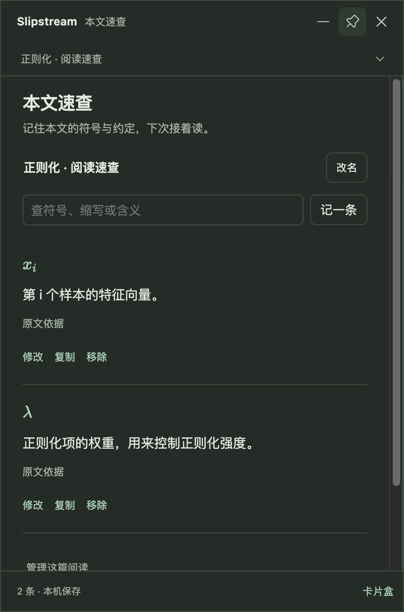

# 本文速查

v1.2.0 新增的阅读能力，随 macOS 正式安装包提供。

界面截图使用自拟材料和固定回复，展示真实窗口中的操作与布局。

## 使用

从首页或菜单栏打开「本文速查」，点击「新建阅读」。名称可以随时修改，例如论文标题或正在读的章节。阅读卡片顶部也可新建、选择或切换归属。

v1.2.1 正式版中，选好阅读后，新截图和粘贴文字沿用它；已有卡片保留自己的归属。选回「临时阅读」即可停止沿用。关闭浮窗后，已留下的定义仍保留，下次启动从上一次选定的阅读继续。

后续的本地阅读预览版改进了切篇：新文档或识别不到来源的截图先作为临时阅读；在卡片内选中或新建阅读后，同一文档窗口的截图会自动找回它。粘贴文字仍沿用当前选定的阅读。预览版的关联字段只保存来源摘要，不保存原始窗口标题或 PDF 路径；从截图新建阅读时，窗口标题会作为可修改的默认阅读名称保存。窗口标题改变或不同文档同名时，需要重新核对归属。[两篇原版论文的原生拖框与重启复验](usability/2026-09-21/daily-reading/source-scope-native.md)已完成；这项改动尚未随正式安装包发布。

专业阅读模式会在翻译的同一次请求中查找原文明确定义的符号、缩写和本文约定。查看候选的中文含义及「原文依据」，点击「留下」或「全部留下」才写入本地。没有定义时保持空白；也可主动「整理这段的符号定义」。

后续段落中匹配到的记录会显示为「本文」符号按钮，点击后直接从本地查回。原文选词同样优先查本文记录。未保存的本段定义标注「本段提取 · 待核对」；没有定义的单个符号提示尚未找到。不同含义保留为多条记录，读者可填写适用章节。

「记一条」支持手写含义、修正符号和补充原文依据；从词句解释也可进入。速查支持搜索、修改、复制、移除，以及删除整篇后的即时撤销。搜索 `λ` 可以找到以 `\lambda` 保存的记录。符号比较区分大小写、上下标和字体修饰；`x`、`X`、`x_i`、`\hat{x}` 不会合并。

## 数据与公式

- 默认保存在系统文稿目录的 `Slipstream/本文速查/references.json`，包含阅读名称、当前选择、显式保留的含义、原句及相应来源段落。本地预览版还会保存主动绑定的窗口来源摘要。
- 未保存的候选随临时卡片关闭而消失。不会保存截图、自动建立完整阅读历史或自动把本文定义加入长期概念卡片盒。
- 已存记录本地查询不调用模型，在基础翻译模式下也可继续查阅和手动记录。新的自动提取需要专业阅读模型。
- LaTeX 在速查、候选、原句和编辑预览中排版。「复制」保留 LaTeX 源格式。识别阶段仍沿用数学 OCR 的核对流程。
- 文件使用串行原子写入，编辑带版本检查；损坏文件不会被自动重建覆盖。应用设置重置保留文稿目录。系统可能根据用户设置同步该目录。

## 验证

`npm run check:reading-references` 覆盖符号身份、引用约束、允许零候选、跨论文隔离、存储重开、过期编辑拒绝、删除撤销，以及真实 Electron 窗口中的创建、保存、查询、编辑与 200% 窄窗口布局。

`npm run check:reading-references-live -- --app="/绝对路径/Slipstream 阅读预览.app"` 使用已签名预览自身的 Keychain 身份、已配置模型和六组自拟片段，检查显式定义、无定义公式、普通叙述、同符号不同含义、大小写和带修饰符号。真实模型证据与固定回复的交互验证分别记录。

2026-09-14：DeepSeek V4 Flash 的六组片段全部通过，[完整输入与输出](reading-reference-evidence/live-reading.json)已记录。第一轮发现模型把 `x_i ∈ R^d` 整段作为名称，修正了名称与取值范围的边界后通过复测；[初次结果](reading-reference-evidence/initial-live-reading.json)保留供追溯。真实 Electron 交互、原有截图及公式回归、macOS 首页、Windows 界面路径、200% 布局、核心检查、IPC 与存储检查、lint 和渲染构建均已通过。Windows 界面路径在本机测试中模拟，未代表新一轮 Windows 真机验收。

这一版的依据来自用户截取或粘贴的段落。提取仍可能漏选或误解原句，保留原文供核对。复杂宏、跨页定义、未截取的上下文及整篇 PDF 的自动解析不在本次验证范围。
